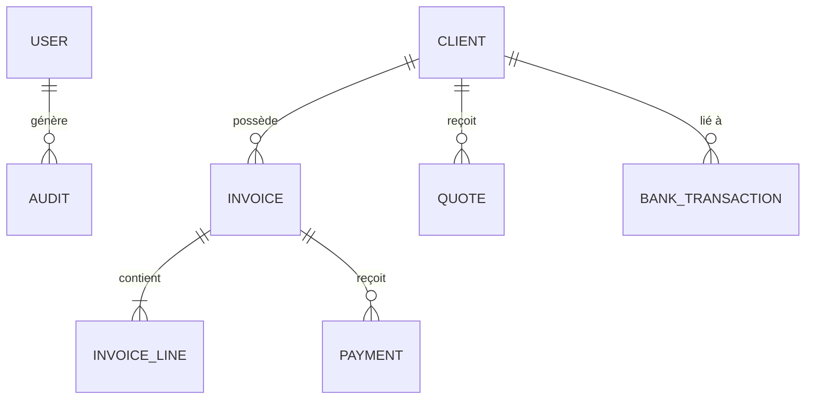

# 📘 Documentation Technique : Plateforme Mynds Finance

Ce document présente la conception technique, l'architecture logicielle et la structure de la base de données de la plateforme **Mynds Finance**.

---

## 1. Vue d'Ensemble
**Mynds Finance** est un tableau de bord financier de pointe conçu pour automatiser la facturation, le suivi de trésorerie et la gestion des ressources humaines. La plateforme est passée d'un stockage local navigateur à une architecture persistante robuste basée sur **PostgreSQL**.

---

## 2. Architecture Logicielle
La plateforme suit une architecture **Client-Serveur** moderne :

### 🏗️ Frontend (Client)
*   **Framework :** React 18+ (Vite)
*   **Styling :** CSS Moderne (Glassmorphism, Design Premium)
*   **Gestion d'État :** Hooks React (useState, useEffect, useMemo)
*   **Synchronisation :** Système hybride (LocalStorage pour la réactivité + API PostgreSQL pour la persistance).

### ⚙️ Backend (Serveur)
*   **Runtime :** Node.js
*   **Framework :** Express.js
*   **ORM :** Prisma (v6) pour une interaction typée avec la base de données.
*   **Authentification :** Gestion de sessions sécurisée avec hachage de mots de passe.

---

## 3. Conception de la Base de Données (PostgreSQL)

### 📊 Modèle de Données (Schéma Prisma)
La structure est centrée sur la relation entre les Clients et leurs Inscriptions financières.

#### Entités Principales :
1.  **User :** Gestion des accès (Admin).
2.  **Client :** Stocke les infos fiscales (MF, Adresse), le régime (Abonnement/One-shot) et les paramètres de facturation.
3.  **Invoice :** Cœur du système. Gère les montants (HT/TVA/TTC), les périodes de service et les statuts de paiement.
4.  **BankTransaction :** Suivi des flux réels sur les comptes BIAT, QNB et Espèces.
5.  **RHState :** Suivi des paiements de salaires et charges sociales.
6.  **AuditHistory :** Journal de bord des actions effectuées pour garantir l'intégrité des données.

---

## 4. Logique Métier & Algorithmes

### 🔄 Système de Migration Atomique
Lors du passage au SQL, un contrôleur de migration a été développé pour garantir qu'aucune donnée ne soit perdue ou dupliquée.
*   **Dédoublonnage :** Algorithme de vérification des clés composites (Client + Date + Montant).
*   **Atomicité :** Utilisation de `prisma.$transaction` pour assurer que soit tout est migré, soit rien (en cas d'erreur).

### 🤖 Automatisation de la Facturation
Le système calcule dynamiquement les factures manquantes basées sur le `jourCycle` et la `dateDebut` du client. 
*   **Rattrapage Historique :** Algorithme spécial pour générer rétroactivement les factures (ex: Elkindy 2024-2025).

### 🏦 Rapprochement Bancaire
Logique permettant de lier une transaction bancaire (Entrée) à une facture émise pour valider le flux financier réel.

---

## 5. Sécurité et Performance
*   **Variables d'Environnement :** Isolation des secrets (DATABASE_URL, JWT_SECRET).
*   **CORS :** Limitation des accès API au domaine frontal uniquement.
*   **Optimisation SQL :** Utilisation d'index sur les IDs et les dates pour des rapports ultra-rapides.

---

## 6. Stack Technique Résumée
| Composant | Technologie |
| :--- | :--- |
| **Langage** | JavaScript (ES6+) |
| **Base de Données** | PostgreSQL 16 |
| **Serveur API** | Express.js |
| **Interface** | React.js |
| **Iconographie** | Lucide-React |
| **Rapports** | Recharts (Visualisation de données) |

---
*Documentation rédigée pour le projet Mynds Finance - Version 1.0 (2026).*
